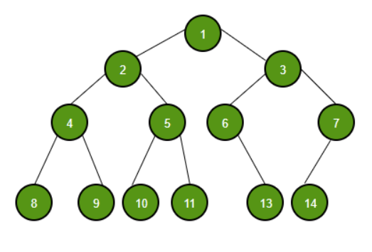
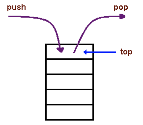

# Data Structures Quiz

Answer the following:

**Yes you can peek at class notes**

<!-- >>>>>>>>>>>>>>>>>>>>>> BEGIN CHALLENGE >>>>>>>>>>>>>>>>>>>>>> -->
<!-- Replace everything in square brackets [] and remove brackets  -->

### !challenge

* type: multiple-choice
* id: 6790235c-a75b-4858-9266-0110de04dcff
* title: Data Structure #1
* points: 1
* topics: trees

##### !question

What is this data structure?



##### !end-question

##### !options

* Array
* Linked List
* Stack
* Queue
* Binary Tree

##### !end-options

##### !answer

* Binary Tree

##### !end-answer

<!-- other optional sections -->
<!-- !hint - !end-hint (markdown, users can see after a failed attempt) -->
<!-- !rubric - !end-rubric (markdown, instructors can see while scoring a checkpoint) -->
##### !explanation

This is a Binary Tree because it's a hierarchical data structure with each node having at most 2 children. 

##### !end-explanation

### !end-challenge

<!-- ======================= END CHALLENGE ======================= -->

<!-- >>>>>>>>>>>>>>>>>>>>>> BEGIN CHALLENGE >>>>>>>>>>>>>>>>>>>>>> -->
<!-- Replace everything in square brackets [] and remove brackets  -->

### !challenge

* type: multiple-choice
* id: cacc2114-7e21-45b9-98b5-0ce6467efbd4
* title: Data Structure #2
* points: 1
* topics: trees

##### !question

What is this data structure?


##### !end-question

##### !options

* Array
* Linked List
* Stack
* Queue
* Binary Tree

##### !end-options

##### !answer

* Queue

##### !end-answer

<!-- other optional sections -->
<!-- !hint - !end-hint (markdown, users can see after a failed attempt) -->
<!-- !rubric - !end-rubric (markdown, instructors can see while scoring a checkpoint) -->
##### !explanation

This is a Queue because it has a front from which items can be removed or dequeued and a rear from which things are added or enqueued.  A Queue is effectively a line.

##### !end-explanation

### !end-challenge

<!-- ======================= END CHALLENGE ======================= -->

<!-- >>>>>>>>>>>>>>>>>>>>>> BEGIN CHALLENGE >>>>>>>>>>>>>>>>>>>>>> -->
<!-- Replace everything in square brackets [] and remove brackets  -->

### !challenge

* type: multiple-choice
* id: ae9e1919-1e5c-4048-92a8-9f20cd50ead4
* title: Data Structure #3
* points: 1
* topics: trees

##### !question

What is this data structure?


Image from Geeks for Geeks

##### !end-question

##### !options

* Array
* Linked List
* Stack
* Queue
* Binary Tree

##### !end-options

##### !answer

* Linked List

##### !end-answer

<!-- other optional sections -->
<!-- !hint - !end-hint (markdown, users can see after a failed attempt) -->
<!-- !rubric - !end-rubric (markdown, instructors can see while scoring a checkpoint) -->
##### !explanation

This is a LinkedList because it's is a linear list of connected nodes which has a specific start or head and each node connects to the next in the list.

##### !end-explanation

### !end-challenge

<!-- ======================= END CHALLENGE ======================= -->

<!-- >>>>>>>>>>>>>>>>>>>>>> BEGIN CHALLENGE >>>>>>>>>>>>>>>>>>>>>> -->
<!-- Replace everything in square brackets [] and remove brackets  -->

### !challenge

* type: multiple-choice
* id: e954cd74-f84e-47a0-83f8-edf25a2740f6
* title: Data Structure #4
* points: 1
* topics: trees

##### !question

What is this data structure?



Image from Carnegie Mellon University

##### !end-question

##### !options

* Array
* Linked List
* Stack
* Queue
* Binary Tree

##### !end-options

##### !answer

* Stack

##### !end-answer

<!-- other optional sections -->
<!-- !hint - !end-hint (markdown, users can see after a failed attempt) -->
<!-- !rubric - !end-rubric (markdown, instructors can see while scoring a checkpoint) -->
##### !explanation

This is a Stack because it's is a linear collection but from which items can only be push onto or popped off of the top.

##### !end-explanation

### !end-challenge

<!-- ======================= END CHALLENGE ======================= -->

<!-- >>>>>>>>>>>>>>>>>>>>>> BEGIN CHALLENGE >>>>>>>>>>>>>>>>>>>>>> -->
<!-- Replace everything in square brackets [] and remove brackets  -->

### !challenge

* type: multiple-choice
* id: 3fd67be1-0228-4aa0-9e62-65adc2cb9583
* title: Data Structures #5
* points: 1
* topics: arrays

##### !question

What is the **time complexity** of inserting an element into the middle of an array?

##### !end-question

##### !options

* O(1)
* O(log n)
* O(n)
* O(n log n)
* O(n^2)

##### !end-options

##### !answer

* O(n)

##### !end-answer

<!-- other optional sections -->
<!-- !hint - !end-hint (markdown, users can see after a failed attempt) -->
<!-- !rubric - !end-rubric (markdown, instructors can see while scoring a checkpoint) -->
##### !explanation

Since you have to shift all the elements in the array over one index to insert the element.


##### !end-explanation

### !end-challenge

<!-- ======================= END CHALLENGE ======================= -->

<!-- >>>>>>>>>>>>>>>>>>>>>> BEGIN CHALLENGE >>>>>>>>>>>>>>>>>>>>>> -->
<!-- Replace everything in square brackets [] and remove brackets  -->

### !challenge

* type: multiple-choice
* id: 538c2401-99b0-41d0-9682-572e57d1781c
* title: Data Structures #6
* points: 1
* topics: arrays

##### !question

What is the **time complexity** of inserting an element into the beginning of a LinkedList.

##### !end-question

##### !options

* O(1)
* O(log n)
* O(n)
* O(n log n)
* O(n^2)

##### !end-options

##### !answer

* O(1)

##### !end-answer

<!-- other optional sections -->
<!-- !hint - !end-hint (markdown, users can see after a failed attempt) -->
<!-- !rubric - !end-rubric (markdown, instructors can see while scoring a checkpoint) -->
##### !explanation

Because it's a linked structure, you can add an element to the beginning of the list without the length of the list impacting the number of steps.

##### !end-explanation

### !end-challenge

<!-- ======================= END CHALLENGE ======================= -->

<!-- >>>>>>>>>>>>>>>>>>>>>> BEGIN CHALLENGE >>>>>>>>>>>>>>>>>>>>>> -->
<!-- Replace everything in square brackets [] and remove brackets  -->

### !challenge

* type: multiple-choice
* id: 95323e18-31e4-4e1d-b2ea-c0ba4892cf49
* title: Data Structures #7
* points: 1
* topics: data structures

##### !question

What does this describe?

```
A type or class who's behavior is described by 
a set of values and public operations without 
specifying how it is implemented
```

##### !end-question

##### !options

* Array
* Linked List
* Abstract Data Type
* Stack

##### !end-options

##### !answer

* Abstract Data Type

##### !end-answer

<!-- other optional sections -->
<!-- !hint - !end-hint (markdown, users can see after a failed attempt) -->
<!-- !rubric - !end-rubric (markdown, instructors can see while scoring a checkpoint) -->
##### !explanation

As stated in [Geeks for Geeks:](https://www.geeksforgeeks.org/abstract-data-types/)

Abstract Data type (ADT) is a type (or class) for objects whose behaviour is defined by a set of value and a set of operations.

The definition of ADT only mentions what operations are to be performed but not how these operations will be implemented. It does not specify how data will be organized in memory and what algorithms will be used for implementing the operations. It is called “abstract” because it gives an implementation-independent view. The process of providing only the essentials and hiding the details is known as abstraction.

##### !end-explanation

### !end-challenge

<!-- ======================= END CHALLENGE ======================= -->

<!-- >>>>>>>>>>>>>>>>>>>>>> BEGIN CHALLENGE >>>>>>>>>>>>>>>>>>>>>> -->
<!-- Replace everything in square brackets [] and remove brackets  -->

### !challenge

* type: multiple-choice
* id: 64c73a5e-5a54-4b06-b08a-2b067535e2bb
* title: Data Structures #8
* points: 1
* topics: data structures

##### !question

What does this describe?

```
A data type in which all elements are stored in 
contiguous memory locations (all right next to each 
other in memory) and any item can be accessed via an 
"index number," in O(1) time.
```

##### !end-question

##### !options

* Array
* Linked List
* Abstract Data Type
* Stack

##### !end-options

##### !answer

* Array

##### !end-answer

<!-- other optional sections -->
<!-- !hint - !end-hint (markdown, users can see after a failed attempt) -->
<!-- !rubric - !end-rubric (markdown, instructors can see while scoring a checkpoint) -->
##### !explanation

As stated in [Geeks for Geeks:](https://www.geeksforgeeks.org/array-data-structure/)

An array is a collection of items stored at contiguous memory locations. The idea is to store multiple items of the same type together. This makes it easier to calculate the position of each element by simply adding an offset to a base value, i.e., the memory location of the first element of the array (generally denoted by the name of the array).

##### !end-explanation

### !end-challenge

<!-- ======================= END CHALLENGE ======================= -->

<!-- >>>>>>>>>>>>>>>>>>>>>> BEGIN CHALLENGE >>>>>>>>>>>>>>>>>>>>>> -->
<!-- Replace everything in square brackets [] and remove brackets  -->

### !challenge

* type: multiple-choice
* id: 9abba2d2-7186-4368-86dd-350985396c6d
* title: Data Structures #9
* points: 1
* topics: data structures

##### !question

What does this describe?

```
A kind of list data type in which begins with a 
specific head element and each element contains a 
reference to the next.

Elements are not stored in contiguous memory 
locations.
```

##### !end-question

##### !options

* Array
* Linked List
* Abstract Data Type
* Stack

##### !end-options

##### !answer

* Linked List

##### !end-answer

<!-- other optional sections -->
<!-- !hint - !end-hint (markdown, users can see after a failed attempt) -->
<!-- !rubric - !end-rubric (markdown, instructors can see while scoring a checkpoint) -->
##### !explanation

As stated in [Geeks for Geeks:](https://www.geeksforgeeks.org/data-structures/linked-list/)

A linked list is a linear data structure, in which the elements are not stored at contiguous memory locations. The elements in a linked list are linked using pointers as shown in the below image:


##### !end-explanation

### !end-challenge

<!-- ======================= END CHALLENGE ======================= -->


<!-- >>>>>>>>>>>>>>>>>>>>>> BEGIN CHALLENGE >>>>>>>>>>>>>>>>>>>>>> -->
<!-- Replace everything in square brackets [] and remove brackets  -->

### !challenge

* type: paragraph
* id: fe147fda-a2b8-4d82-a0dd-e5118e7464f6
* title: Data Structures #10
* points: 1
* topics: graph, tree

##### !question

In plain English, what is the difference between a graph and a tree?

##### !end-question

##### !placeholder

Differences between graph & trees

##### !end-placeholder

<!-- other optional sections -->
<!-- !hint - !end-hint (markdown, users can see after a failed attempt) -->
<!-- !rubric - !end-rubric (markdown, instructors can see while scoring a checkpoint) -->
##### !explanation

A graph can have cycles and can be structured in any manner.  A graph is a hierarchal data structure with a specific starting location, the root and each node is either a parent or child and each node can have at most one parent.

##### !end-explanation

### !end-challenge

<!-- ======================= END CHALLENGE ======================= -->

